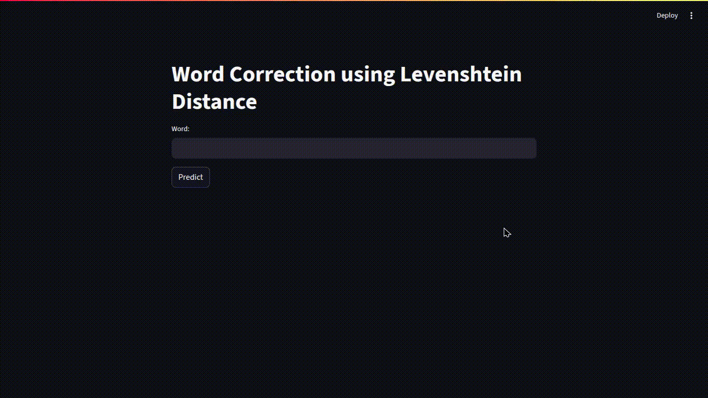

# WordCorrection

A simple yet effective **word correction tool** built with [Streamlit](https://streamlit.io/).  
Users can input a misspelled word, and the app will suggest the most likely correct words using the **Levenshtein distance algorithm**.

---

## Features
- Interactive **Streamlit web interface**.
- Corrects misspelled words by calculating similarity with Levenshtein distance.
- Provides a ranked list of possible corrections.
- Easy to run locally with minimal setup.

---

## Installation

1. Clone this repository:
   ```bash
   git clone https://github.com/your-username/WordCorrection.git
   cd WordCorrection
2. Install the required dependency:
    ```bash
    pip install streamlit

## Usage

1. Run the app
    ```bash
    streamlit run WordCorrection.py

2. Open the generated local URL in your browser.
   You’ll see a simple interface asking for input.

3. Enter a misspelled word and click Predict.
    The app will return possible corrected words ranked by priority.

Example:
